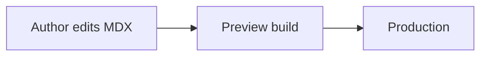
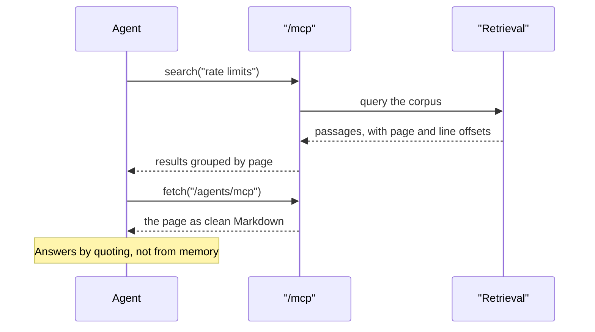

# Code and diagrams

## Code blocks

Write a fenced code block. Do not use a component. Shiki highlights a fence,
and the fence also gets the filename header and copy button. These come from
[`src/lib/rehype-code-chrome.ts`](https://github.com/DuvInc/duvlify/blob/main/src/lib/rehype-code-chrome.ts),
which adds them.

````mdx
```ts title="src/client.ts"
export const client = createClient({ token: process.env.API_TOKEN });
```
````

Which renders as:

```ts title="src/client.ts"
export const client = createClient({ token: process.env.API_TOKEN });
```

`title="…"` sets the filename in the header. Without it, the build uses the
language name.

> **Warning: CodeBlock is not the same thing**
>
> A `<CodeBlock>` component exists for layouts a fence cannot express. Content
> passed to it is **not** highlighted. If you reach for it only to get a title
> or a copy button, use a fence instead. A fence already has both.

Both Shiki themes ship as CSS variables rather than inlined colours. Switching
colour mode therefore needs no re-render, and a light theme's inline styles
never override dark mode.

## Code groups

Group alternatives in a `<CodeGroup>`. Each fence's title becomes its tab
label. The group gets a single copy button that follows the selected tab.

````mdx
<CodeGroup>
```bash title="npm"
npm install
```
```bash title="pnpm"
pnpm install
```
</CodeGroup>
````

```bash title="npm"
npm install
```

```bash title="pnpm"
pnpm install
```

```bash title="yarn"
yarn install
```

Every group that offers the same labels in the same order moves together. The
build remembers the reader's choice for the next page. Add `dropdown` when a
horizontal language strip would be crowded. Add `sync={false}` to keep one
group local.

## Diagrams

A ` ```mermaid ` fence renders a real Mermaid diagram, with `title="…"` as
its caption. The drawing re-renders when the visitor changes colour mode.

Diagrams are drawn in the reader's browser, and Mermaid is a large library. It
is fetched only when a diagram comes within 600px of the viewport, so a page
without diagrams costs nothing and a reader who never scrolls to one pays
nothing. But a reader who does downloads about **180 KB of JavaScript**
(28 chunks, compressed) to draw it. Each diagram is then laid out on its own as
it is reached, rather than the whole page at once.

> **Note: When a diagram is not worth 180 KB**
>
> That library is the same size whether the page has one diagram or ten, and it
> is cached once fetched: diagrams are cheap in bulk and expensive in
> isolation. For a single diagram that never changes, exporting it once and
> committing the SVG costs about 3 KB and no JavaScript at all.
>
> Pre-rendering the fences at build time would remove the cost entirely, and
> this framework deliberately does not: Mermaid measures real text to lay out a
> diagram, so rendering it outside a browser needs a headless Chromium on the
> build machine and in CI. That is a dependency every fork would inherit to
> optimise a page many sites do not have.

````mdx

````


> **Warning: Quote your node labels**
>
> Unquoted Mermaid labels break on parentheses and commas. `A["Evaluate (server)"]`
> is fine. `A[Evaluate (server)]` causes a parse error in the diagram, not in
> the build, so it fails in front of a reader rather than in CI.

Interactive controls appear on hover or keyboard focus: directional movement,
zoom, reset, and a fullscreen viewer with drag, mouse-wheel zoom and keyboard
navigation.

**They are added by height, not by default on everything.** A diagram taller
than 120px gets them; a short one does not, because panning a shape that already
fits on screen is a control with nothing to do. The flowchart above is three
nodes wide and one row tall, which is why it has none. `actions={true}` forces
them on regardless of size, `actions={false}` forces them off, and leaving the
option out asks for the height rule.

Position the inline controls with `placement="top-left"`, `top-right`,
`bottom-left`, or `bottom-right`.

Any diagram type Mermaid supports works in the same fence. This one is a
sequence diagram, and it is tall enough to cross the threshold, so it carries
the controls the flowchart above does not. Hover it.



A second diagram on a page that already has one costs no extra JavaScript: the
180 KB is per reader, not per diagram.

A `<Mermaid>` component also exists, for one-liners and for compatibility with
content authored elsewhere. A fence is the better default choice.

## Images

The build handles content images for you. It automatically adds
`loading="lazy"` and `decoding="async"`. It also adds intrinsic `width` and
`height`, read from the file in `public/`, which is the file that matters.
Without these values, the browser reserves no space, and the page jumps as
each image arrives.

Wrap an image in `<Frame>` to give it a border and a caption:

```mdx
<Frame caption="The rollout screen after a guard metric halts a stage.">
  
</Frame>
```

### How wide a screenshot should be

Export at **1600px wide**, and let the build do the rest. That is the widest
size anything here displays: the reading column is 712px, which a 1392px image
already covers at 2× for a retina screen, and the lightbox a reader opens by
clicking a screenshot asks for around 1650px at its largest on a laptop.

A screenshot taken on a retina display arrives at 2400px or more, and the extra
pixels are invisible. The browser scales them away, so nothing looks wrong
while every reader downloads detail no screen shows. One real site was serving
1.3 MB of screenshots to deliver about 500 KB of visible detail.

```bash
npm run images:optimize
```

That resizes anything in `public/` wider than the cap, re-encoding WebP at a
quality chosen for small text rather than for photographs. It is idempotent, and
`npm run images:check` reports without writing. The test suite runs the same
check, so an oversized screenshot fails the build rather than quietly costing
bandwidth.

> **Note: Resize, don't compress harder**
>
> Re-encoding a screenshot at its original size is close to pointless: measured
> on a real 2398×1490 file, it saved 2 KB of 96 KB, because anything a screenshot
> tool produces is already well compressed. The bytes are in the dimensions, and
> resizing to 1600px took that same file to 64 KB. If a page feels heavy, look at
> how wide its images are before reaching for quality settings.

## Icons

Every icon comes from [Lucide](https://lucide.dev) through `<Icon name="…" />`.
This applies in the navigation, in buttons, and in any `icon` slot on a `Card`
or `Tile`. Never use a raw emoji or Unicode glyph (`✦`, `↗`, `⌕`). These render
without error, but they look inconsistent beside Lucide's icons, with a
different weight, baseline, and style.

```mdx
<Card title="Deploy everywhere">
  <Icon slot="icon" name="rocket" size={22} />
  …
</Card>
```

`name` is a short alias, not the Lucide icon name directly. See the `icons` map
in
[`src/components/Icon.astro`](https://github.com/DuvInc/duvlify/blob/main/src/components/Icon.astro).
If the icon you need is not there yet, import it from `@lucide/astro` and add
one line to that map. Do not use a glyph as a shortcut instead.

## Video embeds

The build rewrites a raw `<iframe>` in content, at build time, into the same
bordered, edge-to-edge card that `<Frame>` produces. So an embed pasted from
YouTube or Loom gets an intrinsic aspect ratio instead of the browser's old
default box. This runs as a remark plugin, before the HTML stage, so it also
handles JSX in content authored for other platforms.
